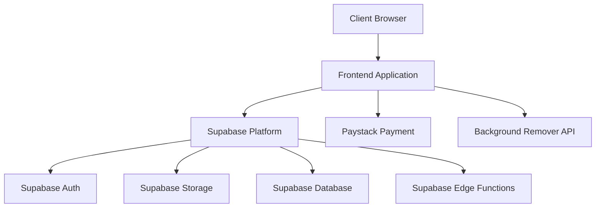

# Technical Architecture

## System Overview

### High-Level Architecture


## Technical Stack

### Frontend
- **Framework**: Next.js 14
- **Language**: TypeScript
- **Styling**: Tailwind CSS
- **State Management**: React Context + Zustand
- **UI Components**: Shadcn/ui
- **Form Handling**: React Hook Form
- **Validation**: Zod
- **API Client**: TanStack Query
- **Authentication**: Supabase Auth
- **Storage**: Supabase Storage
- **Database**: Supabase Database
- **Serverless Functions**: Supabase Edge Functions

### Backend
- **Runtime**: Node.js
- **Framework**: Next.js API Routes
- **Language**: TypeScript
- **Database**: Supabase PostgreSQL
- **ORM**: Prisma
- **Authentication**: Supabase Auth
- **Storage**: Supabase Storage
- **Edge Functions**: Supabase Edge Functions
- **Payment Processing**: Paystack
- **Image Processing**: Background Remover API

### Infrastructure
- **Hosting**: Vercel
- **Database & Auth**: Supabase
- **Storage**: Supabase Storage
- **CDN**: Vercel Edge Network
- **Monitoring**: Vercel Analytics
- **Logging**: Vercel Logs

### External Services
- **Payment Processing**: Paystack
- **Background Removal**: Background Remover API
- **Image Processing**: Sharp (for basic operations)

## Database Schema

### Users (Supabase Auth)
```sql
-- Managed by Supabase Auth
auth.users (
  id UUID PRIMARY KEY,
  email VARCHAR(255) UNIQUE NOT NULL,
  encrypted_password VARCHAR(255) NOT NULL,
  email_confirmed_at TIMESTAMP,
  created_at TIMESTAMP DEFAULT CURRENT_TIMESTAMP,
  updated_at TIMESTAMP DEFAULT CURRENT_TIMESTAMP
);
```

### Projects
```sql
CREATE TABLE projects (
  id UUID PRIMARY KEY DEFAULT uuid_generate_v4(),
  user_id UUID REFERENCES auth.users(id),
  name VARCHAR(255) NOT NULL,
  description TEXT,
  created_at TIMESTAMP DEFAULT CURRENT_TIMESTAMP,
  updated_at TIMESTAMP DEFAULT CURRENT_TIMESTAMP
);
```

### Images
```sql
CREATE TABLE images (
  id UUID PRIMARY KEY DEFAULT uuid_generate_v4(),
  project_id UUID REFERENCES projects(id),
  original_url VARCHAR(255) NOT NULL,
  processed_url VARCHAR(255),
  status VARCHAR(50) NOT NULL,
  metadata JSONB,
  created_at TIMESTAMP DEFAULT CURRENT_TIMESTAMP,
  updated_at TIMESTAMP DEFAULT CURRENT_TIMESTAMP
);
```

### Subscriptions
```sql
CREATE TABLE subscriptions (
  id UUID PRIMARY KEY DEFAULT uuid_generate_v4(),
  user_id UUID REFERENCES auth.users(id),
  plan_id VARCHAR(50) NOT NULL,
  status VARCHAR(50) NOT NULL,
  paystack_subscription_id VARCHAR(255),
  current_period_start TIMESTAMP NOT NULL,
  current_period_end TIMESTAMP NOT NULL,
  created_at TIMESTAMP DEFAULT CURRENT_TIMESTAMP,
  updated_at TIMESTAMP DEFAULT CURRENT_TIMESTAMP
);
```

## API Architecture

### RESTful Endpoints

#### Authentication (Supabase Auth)
- `POST /auth/signup`
- `POST /auth/signin`
- `POST /auth/signout`
- `POST /auth/refresh`

#### Projects
- `GET /api/projects`
- `POST /api/projects`
- `GET /api/projects/:id`
- `PUT /api/projects/:id`
- `DELETE /api/projects/:id`

#### Images
- `POST /api/images/upload`
- `GET /api/images/:id`
- `POST /api/images/:id/process`
- `DELETE /api/images/:id`

#### Subscriptions
- `GET /api/subscriptions`
- `POST /api/subscriptions`
- `PUT /api/subscriptions/:id`
- `DELETE /api/subscriptions/:id`

## Security Architecture

### Authentication
- Supabase Auth with JWT
- Email verification
- Password reset flow
- OAuth providers (optional)

### Authorization
- Row Level Security (RLS) in Supabase
- Role-based access control
- Resource-based permissions

### Data Protection
- Supabase Storage encryption
- Database encryption at rest
- Secure file uploads
- Input validation

## Performance Optimization

### Frontend
- Next.js static and server components
- Image optimization with Next.js
- Edge caching with Vercel
- Service worker caching

### Backend
- Edge Functions for global deployment
- Database indexing
- Query optimization
- Caching strategies

### Infrastructure
- Vercel Edge Network
- Supabase CDN
- Global deployment
- Performance monitoring

## Deployment Architecture

### Development
- Local development environment
- Supabase local development
- Hot reloading
- Development database

### Staging
- Vercel Preview deployments
- Supabase staging environment
- Automated testing
- Performance testing

### Production
- Vercel Production deployment
- Supabase Production environment
- Automated rollback
- Monitoring and alerts

## Monitoring and Logging

### Application Monitoring
- Vercel Analytics
- Error tracking
- Performance metrics
- User analytics

### Infrastructure Monitoring
- Vercel Logs
- Supabase Dashboard
- Database monitoring
- Storage monitoring

### Logging Strategy
- Application logs in Vercel
- Database logs in Supabase
- Error logs
- Audit logs

## Disaster Recovery

### Backup Strategy
- Supabase database backups
- Storage backups
- Configuration backups
- Recovery procedures

### High Availability
- Vercel global deployment
- Supabase multi-region
- Automatic failover
- Data replication

### Business Continuity
- Incident response
- Communication plan
- Recovery time objectives
- Recovery point objectives 