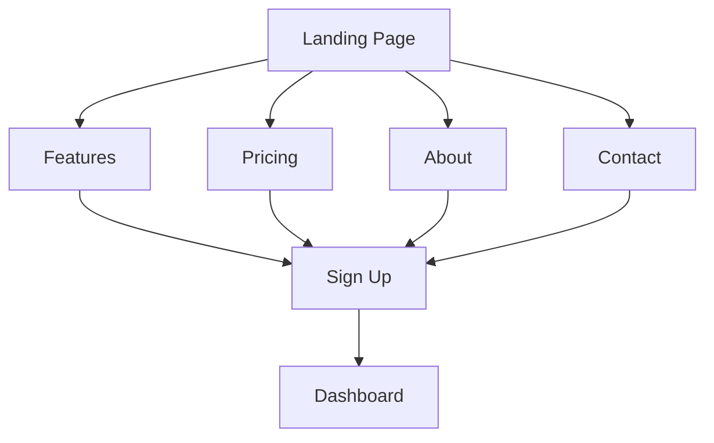
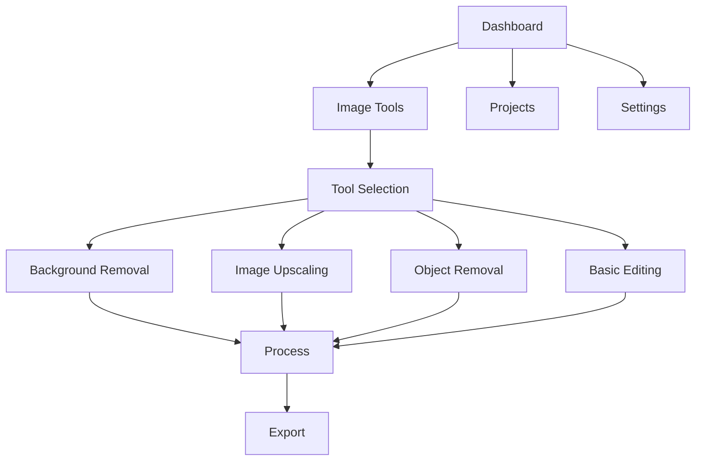
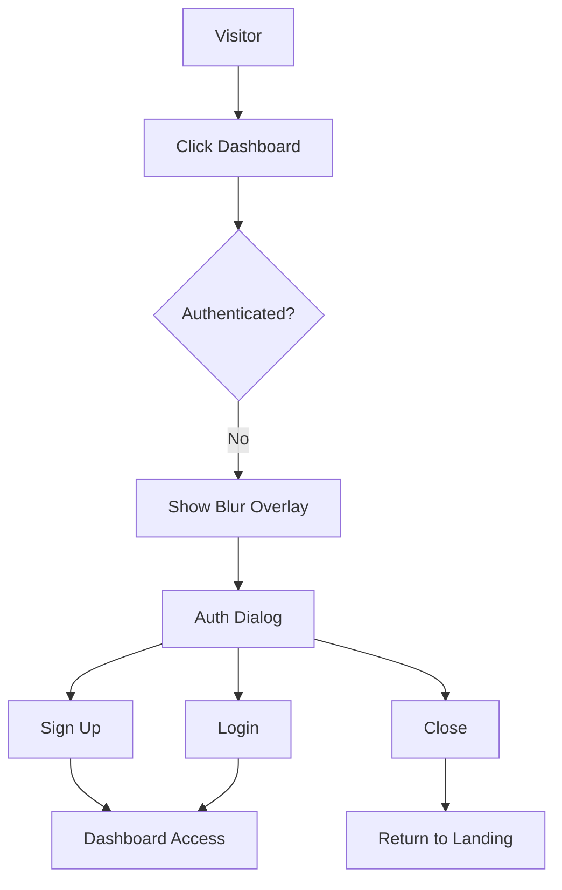

# User Flow Documentation

## User Journey Overview

### 1. Landing Page Experience
1. User lands on homepage
2. Views feature showcase
3. Clicks "Get Started" or "Sign Up"
4. Creates account or logs in

### 2. Authentication Flow
1. **New User Registration**
   - Enter email
   - Create password
   - Verify email
   - Complete profile (optional)

2. **Existing User Login**
   - Enter email/password
   - Two-factor authentication (if enabled)
   - Redirect to dashboard

### 3. Dashboard Experience
1. **Initial Dashboard View**
   - Welcome message
   - Quick start guide
   - Recent projects
   - Usage statistics

2. **Navigation Structure**
   - Dashboard (Overview)
   - Image Tools (Main editing interface)
   - Projects
   - Settings

### 4. Image Tools Dashboard
1. **Layout Structure**
   - Left Sidebar: Tool Categories
     - Background Removal
     - Image Upscaling
     - Object Removal
     - Basic Editing
   - Main Content Area: Selected Tool Interface
   - Top Bar: Tool-specific actions and settings

2. **Tool Selection Flow**
   - Click tool from sidebar
   - Tool interface loads in main area
   - Tool-specific options appear
   - Preview area updates

3. **Visitor Access Control**
   - Unauthenticated users see blurred overlay
   - Authentication dialog appears
   - Options to:
     - Sign Up (Primary action)
     - Login (Secondary action)
     - Close dialog (Returns to landing)

### 5. Image Processing Flow
1. **Upload Process**
   - Drag & drop or click to upload
   - File validation
   - Processing queue

2. **Editing Process**
   - Select editing options
   - Apply changes
   - Preview results
   - Adjust settings

3. **Export Process**
   - Choose export format
   - Select quality settings
   - Download or share

### 6. Premium Features Access
1. **Subscription Flow**
   - View pricing plans
   - Select plan
   - Enter payment details
   - Confirm subscription

2. **Premium Tool Access**
   - Unlock advanced features
   - Access priority processing
   - Use batch processing

## User Interface Flows

### Marketing Website Flow

### Dashboard Flow

### Authentication Overlay Flow

## User States

### 1. Anonymous User
- Access to marketing pages
- View feature demos
- Sign up/login options
- Blurred dashboard preview
- Authentication prompts

### 2. Free User
- Basic image editing tools
- Limited processing quota
- Standard quality output
- Access to Image Tools dashboard

### 3. Premium User
- All basic features
- Advanced AI tools
- Priority processing
- Batch processing
- High-resolution output
- Full Image Tools access

### 4. Enterprise User
- All premium features
- API access
- Custom branding
- Team management
- Advanced analytics
- Enterprise tools

## Error Handling

### 1. Upload Errors
- File size limits
- Unsupported formats
- Network issues
- Server errors

### 2. Processing Errors
- AI model failures
- Timeout issues
- Resource limitations
- Quality warnings

### 3. Payment Errors
- Failed transactions
- Subscription issues
- Refund requests
- Billing problems

### 4. Authentication Errors
- Invalid credentials
- Session expired
- Network issues
- Rate limiting

## Success States

### 1. Image Processing
- Processing complete
- Quality check passed
- Export successful
- Share link generated

### 2. Account Actions
- Registration complete
- Login successful
- Subscription active
- Profile updated

### 3. Payment Processing
- Payment successful
- Subscription activated
- Plan upgraded
- Invoice generated

### 4. Tool Access
- Authentication successful
- Dashboard access granted
- Tool selection available
- Processing enabled

## User Support Flow

### 1. Help Center
- Search documentation
- Browse tutorials
- View FAQs
- Contact support

### 2. Support Tickets
- Create ticket
- Track status
- Receive updates
- Resolve issue

### 3. Community Support
- Forum access
- User guides
- Tips & tricks
- Feature requests 